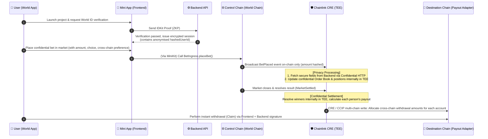

# 🌍 Confidential Prediction Market

> **World ID (Proof of Humanness) 🤝 Chainlink CRE (Confidential Compute)**

This is a decentralised prediction/voting market that combines **World ID's proof of humanness** with the **Chainlink Confidential Runtime Environment (CRE)**. We solve two common pain points in traditional prediction markets: "capital determinism" and "voting privacy leakage".

Here, we guarantee **"1 person, 1 vote"** and **"absolute privacy for bets"**!

---

## 🎯 Core Technological Highlights (Chainlink CRE x Worldcoin)

As general prediction markets focus solely on "capital", this system is exclusively designed for "real humans", making it the perfect showcase for **Worldcoin combined with Chainlink CRE**:

1. **World ID's Sybil Resistance (Proof of Humanness)**
   - Utilises the built-in IDKit within the World App for Headless Proof verification to block bots.
   - Ensures every participant is an independent, real human, achieving authentic "1 person, 1 vote" order placement.
2. **Chainlink CRE's Privacy Computation (Confidential Compute & HTTP)**
   - Users' actual choices, betting options, and amounts are all confidentially matched within the CRE confidential workflow (TEE).
   - Only an "anonymised Hash ID" and "event triggers" are recorded on-chain, preventing hackers and on-chain analysts from reverse-engineering individual decisions.
3. **Seamless Multi-chain Settlement (Multi-chain Payout via CCIP)**
   - Control contracts (BetIngress, MarketRegistry) are deployed on a single master chain (e.g., World Chain).
   - Settlement results are seamlessly and privately distributed to Payout Adapters on target chains (Base, Arbitrum, Polygon, etc.) via CRE's multi-chain write capabilities.

---

## 🏗 System Architecture

We have designed a highly decoupled architecture comprising a "World Mini App lightweight frontend + control chain ingress + CRE confidential settlement + multi-chain payout".

Below is our operational flow and system module diagram:

### 🧩 Core Components Explanation

- **World Mini App Frontend**: Built with React/Next.js and runs natively within the World App via MiniKit. Responsible for invoking verification and transmitting non-sensitive transaction structures.
- **Backend (API Verification Layer)**: Receives the World ID Proof for server-side verification and converts the `nullifier_hash` into an irreversible, anonymised `hashedUserId`, ensuring on-chain footprints are decoupled from real identities.
- **Control Chain Smart Contracts (World Chain)**: Includes `MarketRegistry` to manage market active states and `BetIngress` as the trigger entry point for events, storing absolutely no personal details.
- **Chainlink CRE (Confidential Workflow)**: The core brain of the system. Safely intercepts on-chain and API signals, updates portfolios solely within the TEE, and directly triggers distribution across chains upon settlement—maintaining black-box security throughout.
- **Multi-chain Payout Adapter**: Ultra-lightweight receiving contracts. Receiving settlement instructions from CRE, allowing ultimate winners to directly claim their rewards on their cheapest or preferred L2!

---

> _"Empowering Proof of Humanness with absolute privacy computation. The future of prediction markets is sybil-resistant and completely confidential."_
