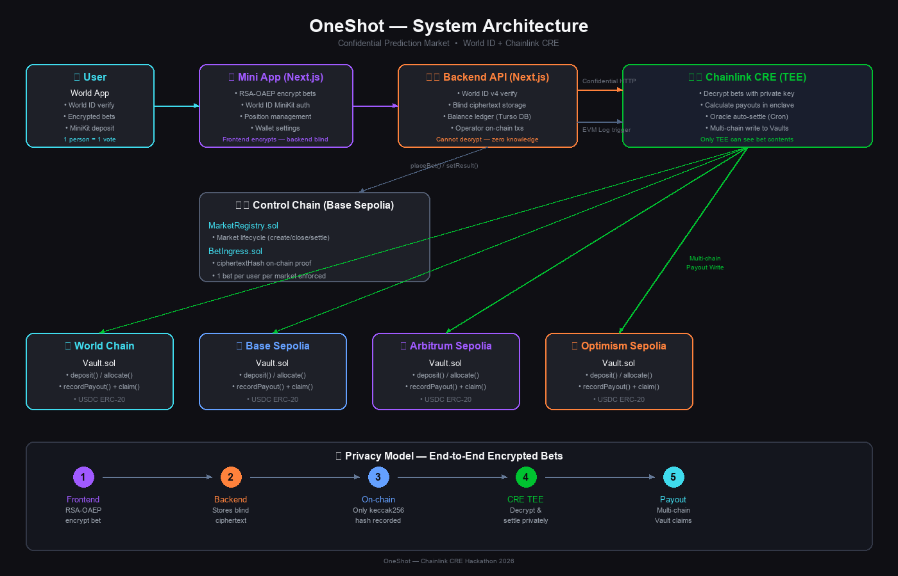

# OneShot — Confidential Prediction Market

> **World ID (Proof of Humanness) + Chainlink CRE (Confidential Compute)**

A decentralised prediction market that combines **World ID's proof of humanness** with the **Chainlink Confidential Runtime Environment (CRE)**. We solve two common pain points in traditional prediction markets: **capital determinism** and **voting privacy leakage**.

**1 person = 1 vote. Absolute privacy for bets.**

---

## Try It

| Platform | Link |
|----------|------|
| **Web App (Browser)** | [one-shot-app.vercel.app](https://one-shot-app.vercel.app) |
| **Mini App (World App)** | [Open in World App](https://world.org/mini-app?app_id=app_b9e7e33956cb8c33ff0c6483c9d43c9c&path=&draft_id=meta_7b4e7111d1e40a95e6417fc130ae3a10) |

**Scan to open Mini App in World App:**

<p align="center">
  
</p>

> **Browser:** Click the Web App link → Enter Demo Mode → deposit demo funds → place an encrypted bet.
>
> **World App:** Scan the QR code or tap the Mini App link → verify with World ID → deposit → bet.

---

## Core Highlights

| | Polymarket etc. | OneShot |
|---|---|---|
| **Voting power** | Capital-weighted (more money = more votes) | 1 person = 1 vote (World ID) |
| **Privacy** | Fully transparent on-chain | Individual bets encrypted, only TEE decrypts |
| **Sybil resistance** | None | World ID Orb-level verification |
| **Settlement** | On-chain verifiable | TEE attestation + on-chain result verifiable |

### Technology Integration

1. **World ID Sybil Resistance** — MiniKit headless proof verification blocks bots. Every participant is a real, unique human.
2. **Chainlink CRE Privacy Computation** — Bets are RSA-OAEP encrypted on the frontend. Only the CRE TEE can decrypt. Backend stores ciphertext blindly.
3. **Multi-chain Settlement** — CRE writes payout results to Vault contracts across Base, Arbitrum, Optimism, and World Chain.

---

## System Architecture



### Components

| Component | Technology | Role |
|-----------|-----------|------|
| **Mini App** | Next.js + MiniKit | World ID auth, RSA-OAEP encrypt bets, wallet management |
| **Backend API** | Next.js API Routes + Turso DB | World ID v4 verify, blind ciphertext storage, operator txs |
| **Control Chain** | Solidity (Base Sepolia) | MarketRegistry + BetIngress — market lifecycle, bet hash proofs |
| **CRE TEE** | TypeScript + @chainlink/cre-sdk | Decrypt bets, calculate payouts, oracle auto-settle, multi-chain write |
| **Vault Contracts** | Solidity (4 chains) | deposit/allocate/recordPayout/claim — USDC ERC-20 |

### Privacy Model

```
Frontend ──RSA-OAEP──▶ Backend ──blind store──▶ On-chain ──hash only──▶ CRE TEE ──decrypt──▶ Multi-chain Payout
   │                      │                        │                        │
   │ Encrypts bet with    │ Cannot decrypt.        │ Only keccak256(ct)     │ Only TEE has
   │ CRE public key       │ Zero knowledge.        │ is recorded.           │ the private key.
```

---

## Deployed Contracts

| Chain | Contract | Address |
|-------|----------|---------|
| Base Sepolia | MarketRegistry | `0xCf334973c9f230c84d3A238Aaf01B821f1100637` |
| Base Sepolia | BetIngress | `0xAe68654757D3E1d292d1Fe29F7329F249845EF8d` |
| Base Sepolia | Vault | `0xFf1B821A9Da78e1d193297fc6281e6bA70CbbdCd` |
| Arbitrum Sepolia | Vault | `0xCf334973c9f230c84d3A238Aaf01B821f1100637` |
| Optimism Sepolia | Vault | `0xCf334973c9f230c84d3A238Aaf01B821f1100637` |
| World Chain Sepolia | Vault | `0xCf334973c9f230c84d3A238Aaf01B821f1100637` |

---

## Tech Stack

| Layer | Technology |
|-------|-----------|
| Mini App Frontend | Next.js (App Router) + MiniKit JS |
| Backend | Next.js API Routes + Turso (libSQL) |
| Smart Contracts | Solidity ^0.8.24, Foundry |
| CRE Workflows | TypeScript, @chainlink/cre-sdk v1.1.4 |
| World ID | MiniKit (mini app) + World ID v4 API |
| Encryption | RSA-OAEP SHA-256 (Web Crypto API) |

---

## Project Structure

```
├── app/                    # Next.js frontend + API
│   ├── src/app/(miniapp)/  # Mini App pages (market, settings)
│   ├── src/app/api/        # Backend API routes
│   ├── src/components/     # React components
│   └── src/lib/            # Shared utilities (auth, db, crypto)
├── contracts/              # Foundry smart contracts
│   ├── src/                # MarketRegistry, BetIngress, Vault
│   ├── script/             # Deploy scripts
│   └── test/               # Solidity tests
└── cre/                    # Chainlink CRE workflows
    ├── src/workflows/      # Settlement + oracle workflows
    └── tests/              # Workflow tests
```

---

## Local Development

```bash
# Install dependencies
npm install
cd app && npm install

# Set environment variables
cp .env.example .env
# Fill in: TURSO_DATABASE_URL, TURSO_AUTH_TOKEN, WORLD_APP_ID, etc.

# Run frontend
cd app && npm run dev

# Run contract tests
cd contracts && forge test

# Run CRE workflow tests
cd cre && npm test
```

---

## Hackathon Tracks

- **Best use of Chainlink CRE** — Confidential HTTP, TEE-encrypted settlement, multi-chain write
- **Best use of World ID** — Sybil resistance, 1 person 1 vote, privacy-preserving auth
- **Privacy track** — End-to-end encrypted bets, zero-knowledge backend

---

> _"Empowering Proof of Humanness with absolute privacy computation. The future of prediction markets is sybil-resistant and completely confidential."_
